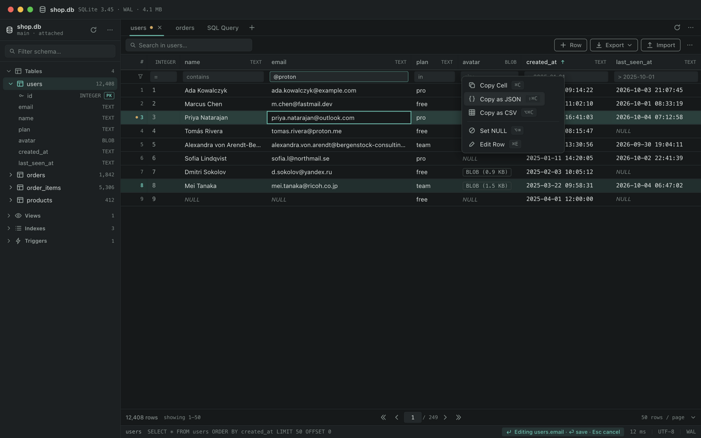

<div align="center">

# Ore

**A lightweight cross-platform SQLite editor for macOS, Windows and Linux.**

[English](README.md) · [Русский](README.ru.md) · [简体中文](README.zh-CN.md)

[](LICENSE)

[](https://tauri.app)



<p><sub>Main window: schema tree, editable grid, cell context menu. There is also a <a href="docs/screenshot-light.png">light theme</a>.</sub></p>


<p><sub>Meet <strong>Mo</strong>, the miner mole — he digs the ore so you don't have to.</sub></p>

</div>

## Why

Ore is built around one job: **open a SQLite file and look at, or fix, your data in as few steps as possible** — a small native app (~10 MB) instead of a browser tab or a heavyweight IDE.

- Opens `.db / .sqlite / .sqlite3` files in seconds — via dialog or drag & drop
- Real desktop app: native menus, system webview, no Electron
- Reads and writes safely: every edit is a parameterized `UPDATE` by `rowid`, CSV import runs in a single transaction with rollback

## Features

- **Schema tree** — tables with columns, types and PK badges, views, indexes, triggers, row counts
- **Data grid** — 50 rows per page, sort by clicking a header, double-click to edit a cell, `Set NULL`, copy cell / row as JSON / CSV, insert and delete rows
- **Column filters** — substring by default, prefix operators `=`, `>`, `<` for exact and numeric comparisons
- **SQL console** — run with ⌘/Ctrl+Enter, results in a grid, error messages straight from SQLite, query history persisted between sessions
- **CSV import** — preview, delimiter choice (`,` `;` tab `|`), create a new table with types inferred from data, or map onto an existing table; empty fields become `NULL`, the whole import is one transaction
- **Export** — table (respecting active filters) or query result to CSV / JSON
- **Dark and light themes**, views and `WITHOUT ROWID` tables open read-only

## Download

Grab an installer from [Releases](https://github.com/javedius/Ore/releases):
`.dmg` (Apple Silicon), `.msi` / `.exe` (NSIS) and `.AppImage` / `.deb` / `.rpm`.

> Builds are produced automatically per tag. Until the first tagged release, use [Build from source](#build-from-source).
> macOS: the simplest way — one command:
> `curl -fsSL https://raw.githubusercontent.com/javedius/Ore/main/install.sh | sh`
> (installs the latest build into /Applications without Gatekeeper prompts).
> Downloading the dmg manually? Copy to Applications and run once:
> `xattr -dr com.apple.quarantine /Applications/Ore.app` (recent macOS reports unsigned
> apps as damaged).

## Build from source

Prerequisites: [Node.js 20+](https://nodejs.org), [Rust](https://rustup.rs), and the platform requirements from [Tauri prerequisites](https://tauri.app/start/prerequisites/) (Xcode CLT on macOS, MSVC on Windows, webkit2gtk packages on Linux).

```bash
git clone https://github.com/javedius/Ore.git
cd Ore/app
npm install
npm run tauri dev     # run the app with hot reload
```

Production build: `npm run tauri build`.
Backend unit tests: `cd app/src-tauri && cargo test`.

## Tech stack

| Layer     | Choice                                             |
|-----------|----------------------------------------------------|
| Shell     | Tauri 2 (system webview, Rust core)                |
| Database  | rusqlite with bundled SQLite (no system dependency)|
| Frontend  | React 19 + TypeScript + Vite                       |
| Design    | in-house “Caliper” system — flat, hairlines, teal accent |

The frontend never builds SQL for edits: the Rust side owns all statements, whitelist-checks every table and column name, and streams rows in pages.

## Project structure

```
app/src           React UI (design tokens in src/styles)
app/src-tauri     Rust backend: rusqlite, IPC commands
docs              Screenshots
demo              Demo database (shop.db) and a CSV to try the import
```

## Contributing

Issues and pull requests are welcome! Pick something from the issue list or propose your own. For development setup see [Build from source](#build-from-source). Please keep UI strings and code comments in English.

## License

[MIT](LICENSE). Bundled SQLite is public domain.

---

<div align="center">
<sub>Ore — ore: the valuable part inside the raw data.</sub>
</div>
